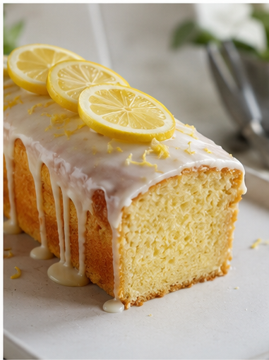

<!DOCTYPE html>
<html lang="en">
<head>
  <meta charset="UTF-8">
  <meta name="viewport" content="width=device-width, initial-scale=1.0">

  <title>Home Style Bakery | Eggless • Organic • Homemade</title>

  <meta name="description" content="Home Style Bakery in London, Ontario. Homemade eggless vegetarian cakes, cheesecakes, breads, cookies and more, made with organic ingredients, no preservatives and no artificial colours.">

  <link rel="preconnect" href="https://fonts.googleapis.com">
  <link rel="preconnect" href="https://fonts.gstatic.com" crossorigin>
  <link href="https://fonts.googleapis.com/css2?family=Caveat:wght@500;600&family=DM+Sans:wght@400;500;600;700&family=Playfair+Display:wght@500;600;700&display=swap" rel="stylesheet">

  
</head>

<body>

  <!-- TOP MESSAGE -->
  

    🌿 Eggless • Vegetarian • Organic Ingredients • No Preservatives • No Artificial Colours
  

  <!-- NAVIGATION -->
  <nav>
    

      <a href="#home" class="logo">
        Home Style Bakery
        Homemade with heart
      </a>

      <ul class="nav-links">
        <li><a href="#home">Home</a></li>
        <li><a href="#products">Our Bakery</a></li>
        <li><a href="#promise">Why Us</a></li>
        <li><a href="#story">Our Story</a></li>
        <li>
          <a
            href="https://wa.me/14379967968?text=Hi%20Home%20Style%20Bakery!%20I%20would%20like%20to%20place%20an%20order."
            target="_blank"
            rel="noopener"
            class="nav-order"
          >
            Order Now
          </a>
        </li>
      </ul>

    

  </nav>

  <!-- HERO -->
  <main id="home">

    <section class="hero">

      

        
Fresh from our kitchen ✦

        <h1>
          Baked with love. 
          Made with <em>goodness.</em>
        </h1>

        

          Delicious homemade treats made with carefully selected organic
          ingredients. Completely eggless and vegetarian, with no preservatives
          and no artificial colours.
        

        

          <a
            href="https://wa.me/14379967968?text=Hi%20Home%20Style%20Bakery!%20I%20would%20like%20to%20place%20an%20order."
            target="_blank"
            rel="noopener"
            class="button button-primary"
          >
            Order on WhatsApp →
          </a>

          <a href="#products" class="button button-secondary">
            Explore Our Bakery
          </a>
        

        

          🌱 Organic
          🥚 Eggless
          🌿 Vegetarian
          🚫 No Preservatives
        

      

      <!-- HERO IMAGE SLOT -->
      

        

        

          Made fresh 
          with care 
          in London, ON
        

      

    </section>

    <!-- PRODUCTS -->
    <section class="section" id="products">

      

        
Something delicious awaits

        <h2>Fresh From Our Kitchen</h2>
        

          From celebration cakes to fresh bread, everything is prepared with
          care and the ingredients we believe belong in good food.
        

      

      

        <!-- LEMON CAKE -->
        <article class="product-card">
          

            
          

          

            EGGLESS
            <h3>Lemon Cake</h3>
            
Light, fresh and full of natural lemon flavour. Homemade and made with care.

            <a class="product-button" target="_blank" rel="noopener"
              href="https://wa.me/14379967968?text=Hi!%20I%27d%20like%20to%20order%20a%20Lemon%20Cake.">
              Order this →
            </a>
          

        </article>

        <!-- BANANA CAKE -->
        <article class="product-card">
          

            
          

          

            HOMEMADE
            <h3>Banana Cake</h3>
            
Moist, comforting and naturally delicious — a classic homemade favourite.

            <a class="product-button" target="_blank" rel="noopener"
              href="https://wa.me/14379967968?text=Hi!%20I%27d%20like%20to%20order%20a%20Banana%20Cake.">
              Order this →
            </a>
          

        </article>

        <!-- PECAN CAKE -->
        <article class="product-card">
          

            
          

          

            PREMIUM
            <h3>Pecan Cake</h3>
            
Rich homemade cake finished with the delicious flavour and texture of pecans.

            <a class="product-button" target="_blank" rel="noopener"
              href="https://wa.me/14379967968?text=Hi!%20I%27d%20like%20to%20order%20a%20Pecan%20Cake.">
              Order this →
            </a>
          

        </article>

        <!-- WALNUT CAKE -->
        <article class="product-card">
          

            
          

          

            FAVOURITE
            <h3>Walnut Cake</h3>
            
A deliciously nutty homemade cake with generous pieces of walnut throughout.

            <a class="product-button" target="_blank" rel="noopener"
              href="https://wa.me/14379967968?text=Hi!%20I%27d%20like%20to%20order%20a%20Walnut%20Cake.">
              Order this →
            </a>
          

        </article>

        <!-- STRAWBERRY CHEESECAKE -->
        <article class="product-card">
          

            
          

          

            FRESH
            <h3>Strawberry Cheesecake</h3>
            
Creamy, rich and topped with the bright flavour of strawberries.

            <a class="product-button" target="_blank" rel="noopener"
              href="https://wa.me/14379967968?text=Hi!%20I%27d%20like%20to%20order%20a%20Strawberry%20Cheesecake.">
              Order this →
            </a>
          

        </article>

        <!-- CHEESECAKE -->
        <article class="product-card">
          

            
          

          

            MADE FRESH
            <h3>Classic Cheesecake</h3>
            
Rich, creamy and made fresh to order for a simple, delicious dessert.

            <a class="product-button" target="_blank" rel="noopener"
              href="https://wa.me/14379967968?text=Hi!%20I%27d%20like%20to%20order%20a%20Cheesecake.">
              Order this →
            </a>
          

        </article>

        <!-- COOKIES -->
        <article class="product-card">
          

            
          

          

            BAKED FRESH
            <h3>Homemade Cookies</h3>
            
Simple, comforting cookies made with quality ingredients and homemade goodness.

            <a class="product-button" target="_blank" rel="noopener"
              href="https://wa.me/14379967968?text=Hi!%20I%27d%20like%20to%20order%20Cookies.">
              Order this →
            </a>
          

        </article>

        <!-- FOCACCIA -->
        <article class="product-card">
          

            
          

          

            FRESH BAKED
            <h3>Focaccia Bread</h3>
            
Freshly baked focaccia with a soft centre and deliciously golden crust.

            <a class="product-button" target="_blank" rel="noopener"
              href="https://wa.me/14379967968?text=Hi!%20I%27d%20like%20to%20order%20Focaccia%20Bread.">
              Order this →
            </a>
          

        </article>

        <!-- BREAD -->
        <article class="product-card">
          

            
          

          

            HOMEMADE
            <h3>Fresh Bread</h3>
            
Soft, fresh and made with the simple goodness of homemade bread.

            <a class="product-button" target="_blank" rel="noopener"
              href="https://wa.me/14379967968?text=Hi!%20I%27d%20like%20to%20order%20Fresh%20Bread.">
              Order this →
            </a>
          

        </article>

        <!-- CUSTARD -->
        <article class="product-card">
          

            
          

          

            HOMEMADE
            <h3>Homemade Custard</h3>
            
Silky, comforting custard prepared with care for a delicious homemade treat.

            <a class="product-button" target="_blank" rel="noopener"
              href="https://wa.me/14379967968?text=Hi!%20I%27d%20like%20to%20order%20Custard.">
              Order this →
            </a>
          

        </article>

        <!-- GHEE -->
        <article class="product-card">
          

            
          

          

            TRADITIONAL
            <h3>A2 Desi Ghee</h3>
            
Traditionally prepared ghee made with care and a focus on simple ingredients.

            <a class="product-button" target="_blank" rel="noopener"
              href="https://wa.me/14379967968?text=Hi!%20I%27d%20like%20to%20order%20A2%20Desi%20Ghee.">
              Order this →
            </a>
          

        </article>

      

    </section>

    <!-- BRAND PROMISE -->
    <section class="promise-section" id="promise">

      

        

          
The Home Style difference

          <h2>Good food starts with good ingredients.</h2>
          

            We believe homemade food should be simple, honest and made with
            ingredients you can feel good about.
          

        

        

          

            
🌿

            <h3>Organic Ingredients</h3>
            
We choose organic ingredients wherever possible to keep our recipes simple and wholesome.

          

          

            
🥚

            <h3>100% Eggless</h3>
            
Every item is made without eggs, so everyone can enjoy our homemade treats.

          

          

            
🎨

            <h3>No Artificial Colours</h3>
            
We avoid artificial colours and let our food look naturally delicious.

          

          

            
🚫

            <h3>No Preservatives</h3>
            
Our focus is fresh, homemade food without unnecessary preservatives.

          

        

      

    </section>

    <!-- STORY -->
    <section class="story" id="story">

      

        
      

      

        
A little taste of home

        <h2>Made the way homemade food should be.</h2>

        

          At Home Style Bakery, we believe the best food doesn't need to be
          complicated. It starts with good ingredients, traditional care and
          the patience to make things properly.
        

        

          From cakes and cheesecakes to fresh breads, focaccia, cookies and
          custards, every order is prepared with the same care we'd put into
          food for our own family.
        

        

          Proudly serving the London, Ontario community with homemade,
          eggless and vegetarian goodness.
        

        
Made with love ♡

      

    </section>

    <!-- ORDER CTA -->
    <section class="order-section">

      

        
Ready for something delicious?

        <h2>Let's make your next treat.</h2>

        

          Tell us what you're looking for and we'll be happy to help with your
          order. Cakes, cheesecakes, breads, cookies and more — made fresh with care.
        

        <a
          href="https://wa.me/14379967968?text=Hi%20Home%20Style%20Bakery!%20I%20would%20like%20to%20place%20an%20order."
          target="_blank"
          rel="noopener"
          class="button button-primary"
        >
          Order on WhatsApp →
        </a>

        
          WhatsApp: +1 437-996-7968
        

        

          📍 London, Ontario, Canada
        

      

    </section>

  </main>

  <!-- FOOTER -->
  <footer>

    

      

        <h3>Home Style Bakery</h3>
        

          Homemade goodness made with organic ingredients,
          without eggs, preservatives or artificial colours.
        

      

      

        <h3>Explore</h3>
        

          <a href="#home">Home</a>
          <a href="#products">Our Bakery</a>
          <a href="#promise">Why Us</a>
          <a href="#story">Our Story</a>
        

      

      

        <h3>Order</h3>
        

          <a
            href="https://wa.me/14379967968?text=Hi%20Home%20Style%20Bakery!%20I%20would%20like%20to%20place%20an%20order."
            target="_blank"
            rel="noopener"
          >
            WhatsApp Us
          </a>
          <a href="tel:+14379967968">+1 437-996-7968</a>
          <a href="#products">View Products</a>
        

      

    

    

      © 2026 Home Style Bakery · London, Ontario · Made with love ♡
    

  </footer>

</body>
</html>
